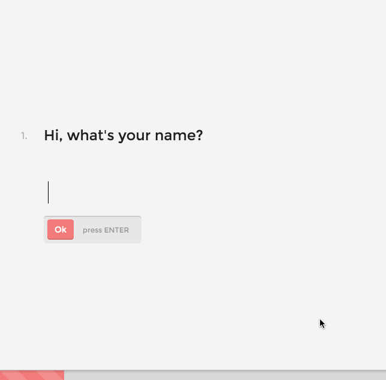

# Simple Form Component
> This is a work-in-progress of how configurable forms would look as a React component



The goal here is to have a main component that takes in an array of `questions`. Then, based on the configuration, renders the correct form inputs. The sub-components, along with the main component make use of `container-queries`, so each component makes the best use of the space that it takes up.

Example of a set of questions:
```js
[
  {
    title: "Hi, what's your name?",
    id: "name",
    type: "text",
  },
  {
    title: "How old are you, <%= name %>?",
    id: "age",
    type: "number",
  },
]
```

This component also uses templating, so the above `<%= name %>` will get replaced with the `name` property if it has already been filled out. 

### Inputs currently implemented
- Text input (with confirmation)
- Select list

There is still much more to do to on this. Some ideas are:
- Keyboard navigation for the select inputs
- Collapsing select inputs to a dropdown when the element gets smaller
